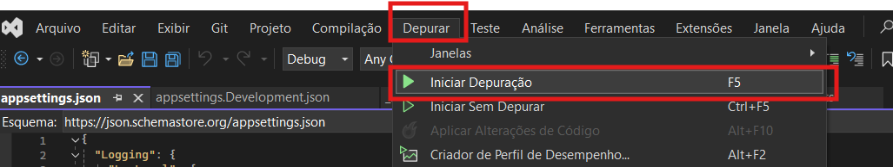

# Teste Desenvolvedor .NET

Neste repositório está os arquivos desenvolvidos para avaliação da CRM Educacional.

## O Desafio

Criar um servidor que provê uma API com o objetivo de fornecer informações sobre Inscrições de candidatos de um vestibular.

## Back-End

Abaixo as Tecnologias e FrameWorks utilizado para desenvolvimento da API.

* Linguagem: C# utilizando o .NET 6 (p .NET 5 não há mais suporte para o mesmo);

* Banco de Dados: MySQL através do Workbench;

* Mapeamento objeto-relacional (ORM): EntityFramework, para facilitar a comunicação com o banco de dados;

* Swagger: Para disponibilização da API;

## Front-End

Abaixo as Tecnologias e FrameWorks utilizado para desenvolvimento da API.

* Linguagem: C# utilizando o Asp.NET;

* Boodstraap;

* Jquery;

* DataTabled;
  
* Datapicker;

* Font-Awesome
  
## Utilização

1. No diretório raiz deste projeto, encontra-se uma pasta chamada "bd", nela se enconta o arquivo dump contendo toda a estrutura do banco de dados que será utilizado para executar a aplicação.
   
   
   
   

2. O banco de dados utilizado se chama "bd_crm", caso deseja alterar, altere nos seguintes lugares:

   * Arquivo dump;
     
   
   
   * A string de conexão localizada no arquivo json da aplicação;
     
   

3. No diretório raiz deste projeto, encontra-se uma pasta chamada "projeto", nela se enconta o arquivo da aplicação em si;

   

   

4. Para executar aplicação, basta utilizar a opção "Depurar-> Iniciar Depuração";

   

4. Para verificação da API, basta selecionar a opeção "Swagger";
   
   

   

5. Para verificação da utilização da API, basta utilizar alguma das opções disponibilizadas;
   
   

6. Abaixo o link doo vídeo com o detalhe do desenvolvimento. Devido ao selo de não verificado do YouTube, apenas posso subir vídeos de 15 m cada. Com isso, o vídeo foi divido em duas partes;

   * <a href="https://youtu.be/EJplvIq12eg" targent="_blanck">YouTube - Parte 1</a>
   
   * <a href="https://youtu.be/J6cV_eft2uQ" targent="_blanck">YouTube - Parte 2</a>
   
## Entregas

Para realizar a entrega do teste você deve:

* Faça um commit da sua branch com a implementação do teste
  
* Realize o pull request da sua branch nesse repositório

Além do pull request você deve **gravar um vídeo de no máximo 30 minutos** mostrando o que foi desenvolvido, falando sobre as decisões que foram tomadas, as tecnologias utilizadas, arquitetura e tudo que você achar relevante. A facecam é opcional, mas é um extra desejável. Esse vídeo deve ser postado no youtube (pode ser não listado) e seu link deve estar no `README.md` do projeto.
